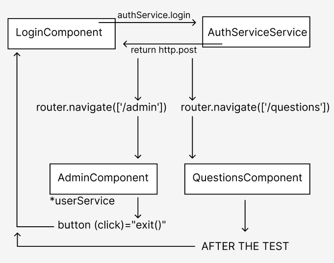

# Preface

**!IMPORTANT!** Some aspects of the technical specifications and certain parts of the project itself are **not entirely logical**. Ideally, they should be adapted for potential expansion of the project, etc. However, **the client wanted it this way**. Plus, according to my estimates, theoretically, adapting for future modernization and improvement of the project would have taken more time and, as a result, the project would not have been ready on time.
P.S. Wherever possible, I made it as adaptable as possible for future improvements.

# Project Description

This is a project: [backend](https://github.com/bublik-liquidator/backend-testing/tree/master)

**User** this entity can pass the test: there are about 20-30 questions in the test, for each question there are 5 possible answers, the user can choose only one answer out of 5.
After selecting all the answers, the user clicks the Send button and that's all the features and functionality for user.

**Admin** is an entity that cannot take the test. However, it can:

- View the number of users who have passed the test.
- View the users who have not passed the test.
- Get test results in a table: the total selection of a specific answer to a question is shown, i.e. how many users chose a particular answer option to a question. The results are sorted by groups.
- Save the results as a table on their device in .docx format.
- Add information before saving the results: date and a brief description of the results.
- Get the names of all users and their group_id.
- Change the password and group_id of a user.
- Create a new user: new_name, new_password, new_group_id.
- Update the content of a question and its answers.
- Get information from the table where user IDs and their answer options are stored.
- Clear user answers in the table.

<h3>Project schema</h3>
<figure>
  
</figure>

## Launch

- Run `ng serve` for a dev server. Navigate to `http://localhost:4200/`. The application will automatically reload if you change any of the source files.
- To launch the [backend](https://github.com/bublik-liquidator/backend-testing/tree/master): run the `back.js` file, in the console `nodemon`.

**## IMPORTANT**
The project is being modernized, so various bugs may occur. If you find any, please let me know😉

